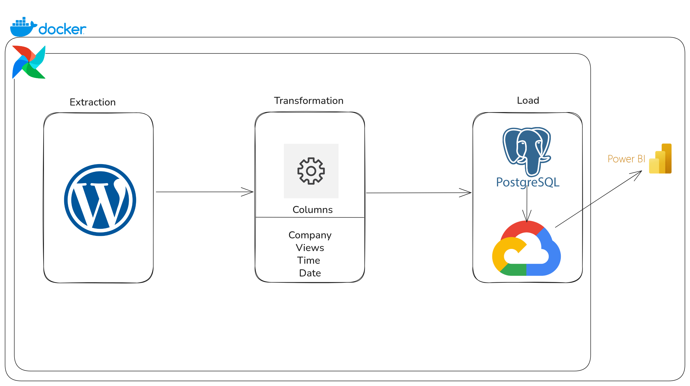
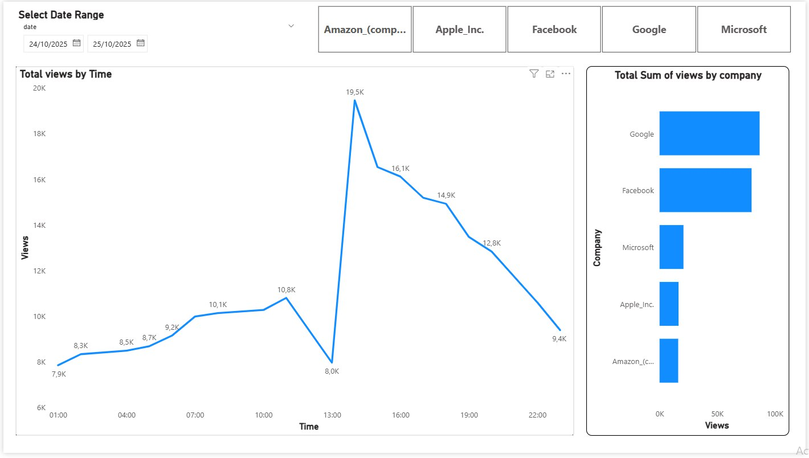
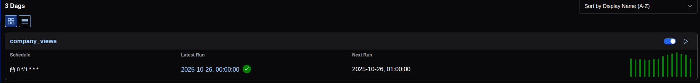
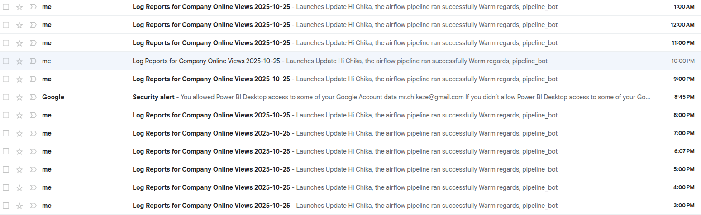

# Architecture Diagram

# The Power BI Dashboard 

# The Airflow Running

# Email Notification

## Content
    The Architecture
    The Power BI Dashboard
    The Airflow Running
    Idempotency

## The Architecture.
The entire ETL Program is running on docker, and orchestrated using Apache Airflow. The task is to get the page view count from wikki and select only 5 companies and make little analysis. 

<b>Extraction:</b>
    I extracted the file from the page. Although, the task was to extract for one particular day but i wanted the whole process to be dynamic so i wrote the Extraction code to be getting data from this year, this month and the recent uploads. that means it will repeat the process tomorrow, next month, next year and continously for every hour.

<b>Transformation:</b>
    From the extraction, the filename i was able to extract the date and time. then i read the content of the file to get the company names, and views.

<b>Loading:</b> 
    After the transformation, I uploaded the data to the postgres running on my docker, and to be able to use the data for analysis i created a data warehouse, where the power BI will read data from. To make sure the data and the warehouse data are same, I first uploaded the data to the postgres database, then copy all the data to the warehouse. There will be no duplicate.

# The Power BI Dashboard.
### Total Sum of Views by Company.
this section of the dashboard is not controlled by the name of the company filter. this is meant to show the most viewed company overall.

### Total Views by Time.
The data is visualised using line chart and this tool respond to the "Select Date Range", so the user can interract with the date and line chart.

<b>This is just a simple dashboard</b>

# The Airflow.
The image is just showing a working airflow running every 1 hour without <b>Error</b>. had to do a lot of testing with errors especially connecting to the Google cloud for GCP Bucket and Bigquery.

# Email Notification.
I integrated email notification into my dags, for easy notification and monitoring. 

# Idempotency.
I made sure no duplicate when inserting into the postgres database and when copying to the cloud, the new data will overide the old ones. so the old data and new data will be there without duplicate.